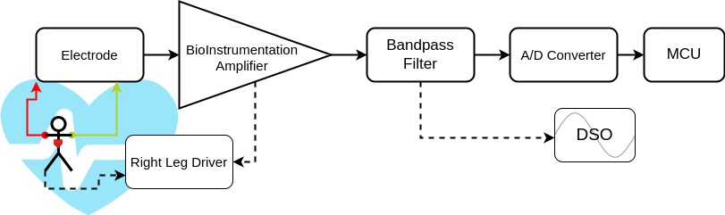
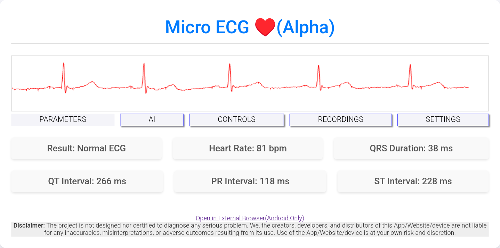
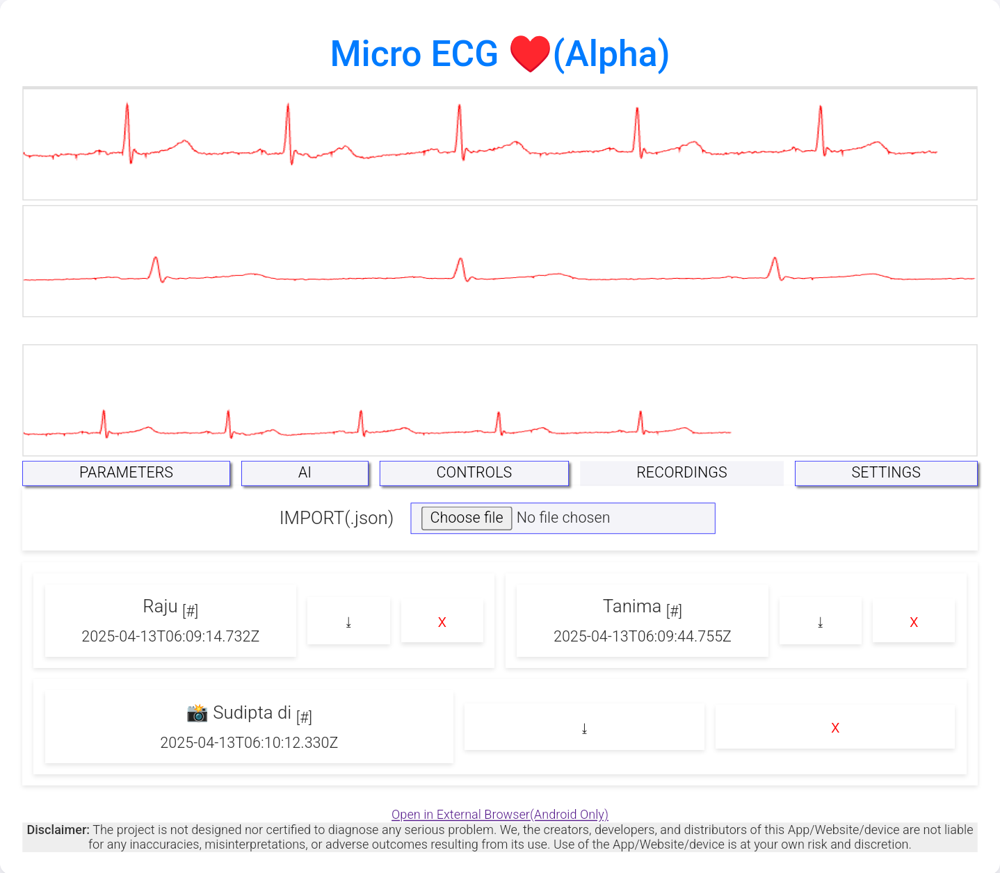
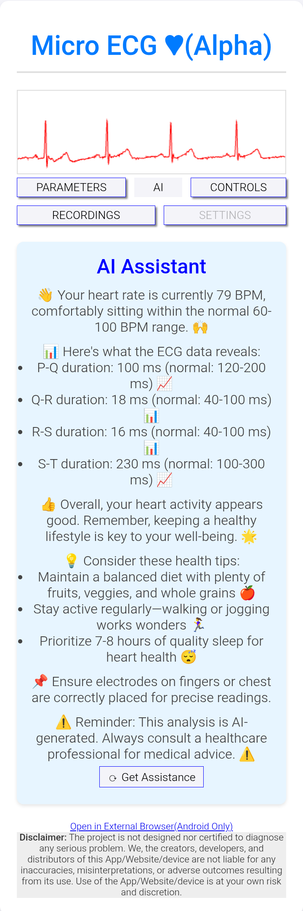
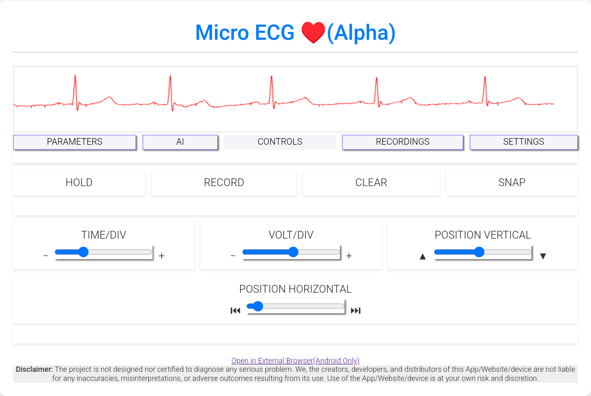

# 🫀 MicroECG – Final Year Diploma Project (2025)


📅 **Project Date**: June 2025  
🎓 **Institution**: Ranaghat Government Polytechnic  
🛠 **Department**: Electrical Engineering

---

## 🔍 Project Summary

**MicroECG** is a single-lead ECG monitoring system developed as a final year diploma project. It streams real-time ECG data from the device to any browser over Wi-Fi using a built-in captive portal—no apps, no cloud, no setup.

> Aimed at making low-cost cardiac monitoring more accessible, especially in resource-limited environments.

---

## 🧠 Key Objectives

- Build a low-cost, portable ECG machine
- Enable **app-less**, cross-platform usage
- Ensure real-time visualization using **WebSocket**
- Host frontend via **captive portal** for instant access
- Integrate optional AI analysis using 3rd-party APIs

---

## 🧠 System Architecture

- Analog Frontend → AD8232
- ESP8266 → 10-bit ADC → WebSocket → HTML5 Canvas
- Web interface with **controls, graphs, AI, recordings**



---

## ⚙️ Core Components

| Module         | Specs/Details                       |
|----------------|-------------------------------------|
| MCU            | ESP8266 (2.4GHz Wi-Fi, 10-bit ADC)  |
| Analog Frontend| AD8232 (Bio-Instrumentation IC)     |
| Battery        | 1200mAh Li-ion                      |
| UI             | HTML5/JS served from ESP8266        |
| Comm. Protocol | WebSocket (Real-time data stream)   |
| Electrodes     | LA/RA (touch) + optional chest lead |

---

## 🔌 How It Works

1. **Power On**  
2. **Connect to Device Wi-Fi**  
3. **Captive Portal opens automatically**  
   (or go to [http://172.217.28.1](http://172.217.28.1))  
4. **Touch electrodes / connect chest lead**  
5. **View ECG waveform on screen**

---

## 🖥 Features

- **Live ECG Graph** over WebSocket
- **Real-Time Parameters**: HR, QRS, QT, PR, ST
- **Touch + External Electrodes**
- **SNAP** to capture graph image
- **RECORD & EXPORT** sessions
- **Import JSON** recordings
- **Experimental 3rd party AI Assistant(Botpress API)**
- **Ease of use** via captive portal

---

## 📌 Future Scope

- [ ] OTA Update support (Planned)
- [ ] On-device AI (TinyML)
- [ ] Bluetooth support via ESP32
- [ ] Multi-lead input via analog mux
- [ ] Cloud dashboard & remote sync

---

## 📁 Folder Structure

```

├── ECG\_UI\_new/          # Firmware + Web UI
├── User Manual/         # Operation guide PDFs
├── Report/              # Project documentation
├── 3d Model and Videos/ # Demo and prototype clips
├── PPT/                 # Seminar Presentation
├── images/              # All used diagrams, screenshots and photos
├── ESP8266\_sketch.ino   # Firmware source code
├── README.md

```

---

## 🧪 Screenshots

<p float="left">
  
  
</p>
<p float="left">
  
  
</p>

---

## 👨‍🔬 Team Members

- Raju Adhikary  
- Tanima Ghosh  
- Sudipta Sen  
- Ruma Mandi  
- Goutam Ambali  
*(Under guidance of Mr. Souvik Bag, Lecturer – EE Dept., RGP(Formally RAN))*

---

## ⚠ Disclaimer

This is a **student project prototype**.  
Not for clinical, diagnostic, or therapeutic use.  
Use it for **educational and experimental purposes only**.

---

## 📄 License

MIT – See [LICENSE.md](LICENSE.md)

---

## 🔖 Tags

`#FinalYearProject` `#ESP8266` `#ECG` `#AD8232` `#WebSocket` `#WiFiCaptivePortal`  
`#Microcontroller` `#MedicalElectronics` `#EmbeddedSystems`
`#IoT` `#RealTimeMonitoring`

```
